# Pecky User Guide

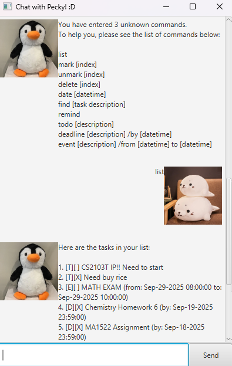

> “Your mind is for having ideas, not holding them.” – David Allen ([source](https://dansilvestre.com/productivity-quotes))

Pecky frees your mind of having to remember things you need to do. It's,

* text-based
* easy to learn
* ~~FAST~~ _SUPER FAST_ to use

All you need to do is,

1. download it from [here](https://github.com/bentandj/ip/releases/tag/A-Release).
2. double-click it.
3. add your tasks.
4. let it manage your tasks for you 😉

And it is **FREE**!

## List current tasks

It will show all the tasks you've input in an ordered list!

Simply type:

`list`

And it will list out as follows:

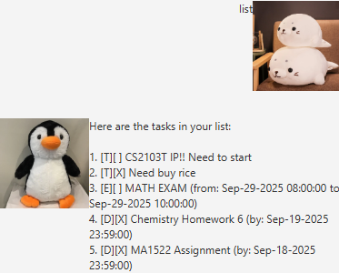

## Mark and unmark tasks

You can mark tasks as completed or not completed!

The commands are as follows:

`mark [index]`
`unmark [index]`

For example:

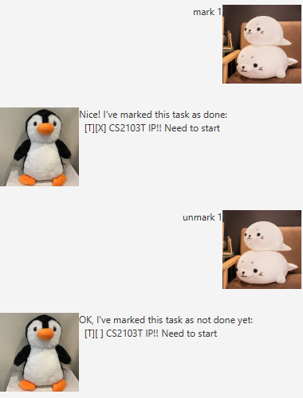

## Delete tasks

Don't want to get ptsd from that random project again? Or wanna pretend that
math doesn't exist? Just delete it!

The syntax is:

`delete [index]`

For example:

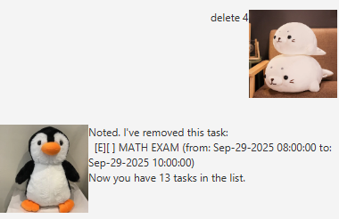

## Find tasks occurring on a certain date

Shiver me timbers! I forgot what's happening tomorrow! Oh wait, just type this:

`date [datetime]`

And here it is!

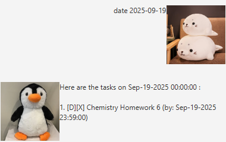

## Find tasks by description

Too many tasks! Just search! Pecky will find your task by matching your input to
the task description.

The syntax is

`find [task description]`

Here's the output:

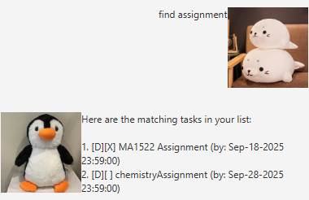

## Remind what are the deadlines in the next 7 days

Oof, we have all been there. The dreaded omae wa mou shindeiru of the year.
Please keep calm and type in the following 6 characters.

The syntax is

`remind`

Let's see what you have:

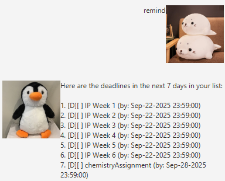

## Add todo

Oh yes, don't forget, your favorite prof can always give you fun things to think about!
Here's how you can brighten your day by adding to your list.

The syntax is

`todo [description]`

Here's an example:

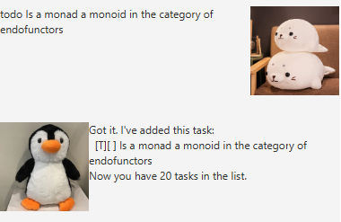

## Add deadline

Oh yes but this is probably the one you care about the most (but also the one you don't want to think about). How do we add in a new deadline?

The syntax is

`deadline [description] /by [datetime]`

This is an example:

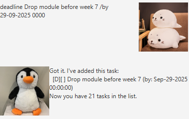

## Add event

And finally, after all the todos and deadlines, maybe you want to look forward to something.
What if you want to add an event?

The syntax is

`event [description] /from [datetime] to [datetime]`

This is an example:

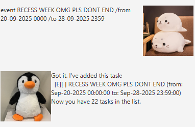

## Pecky remembers you!

You can close the application at any point in time and when you come back, all your tasks will still be there! Don't worry, Pecky doesn't have dementia ~~(unlike you)~~.

## Oh no, I've forgotten the command!

Don't worry, Pecky is smart and can tell you just suffered from a bout of amnesia. After you input 3 commands it doesn't know, Pecky will give you the command list! Here's what it will say!

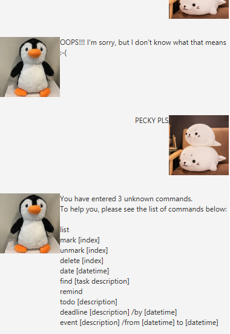